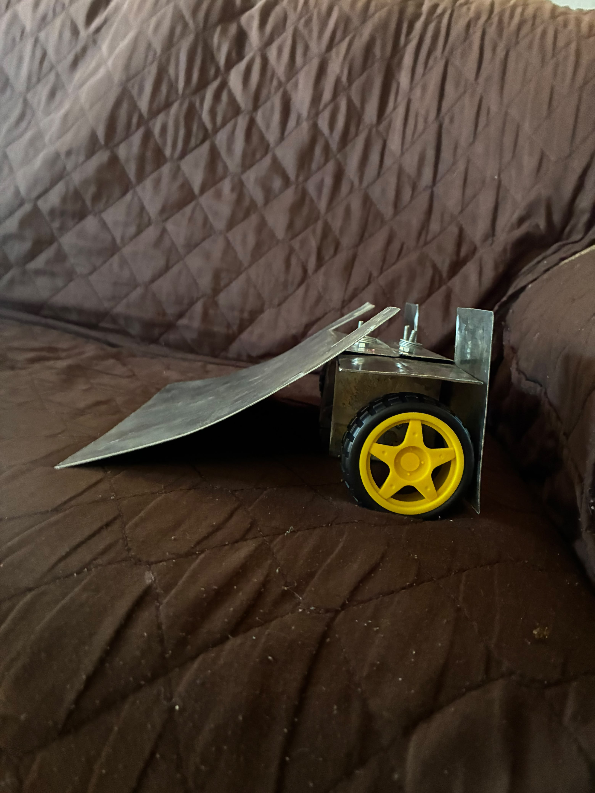

# 🤖 Robô de Sumô — TJR Paraíba

Este repositório reúne a programação do nosso **robô de sumô autônomo**, desenvolvido para participar do **Torneio Juvenil de Robótica (TJR) da Paraíba**.

A ideia do projeto é fazer com que o robô consiga lutar sozinho dentro da arena, identificando o adversário, atacando no momento certo e evitando sair da área de combate.

---

## 📸 Nosso robô

<!-- Coloque aqui uma foto principal do robô -->

  

---

## Sobre o projeto

No sumô de robôs, não basta apenas ter força. O robô também precisa saber onde está o adversário e reagir rápido ao que acontece durante a luta.

Por isso, estamos desenvolvendo uma programação que permite ao robô tomar suas próprias decisões a partir dos sensores instalados nele.

Durante uma partida, ele pode:

* procurar o adversário;
* avançar quando identifica o oponente;
* perceber quando existe um adversário atrás;
* identificar a borda da arena;
* recuar e corrigir sua trajetória antes de sair da área de combate.

A prioridade é sempre permanecer dentro da arena. Depois disso, o robô decide a melhor forma de procurar e atacar o adversário.

---

## 🛠️ Construção

<!-- Coloque aqui fotos da montagem, estrutura ou eletrônica -->

Aqui podem ser registradas algumas etapas da construção e dos testes realizados no robô.

---

## 🧠 Como ele funciona

O robô utiliza sensores para observar o que está acontecendo ao seu redor.

Os sensores de distância ajudam a encontrar o outro robô, enquanto os sensores voltados para o chão ajudam a perceber quando ele está chegando perto da borda.

A partir dessas informações, a programação decide se é melhor **avançar, recuar, girar ou continuar procurando**.

Tudo isso acontece automaticamente durante a partida.

---

## 📷 Sensores e componentes

<!-- Coloque aqui uma foto mostrando sensores, motores ou parte interna -->
---

## 💻 Código

O código principal do projeto está no arquivo:

`Sumo.cpp`

Nele está a lógica utilizada para controlar os sensores, os motores e as decisões tomadas pelo robô durante uma luta.

---

## 🏆 TJR Paraíba

O projeto está sendo desenvolvido com foco na participação no **Torneio Juvenil de Robótica — TJR Paraíba**, na modalidade de **Sumô**.

Além da competição, o desenvolvimento do robô também é uma forma de colocar em prática conhecimentos de programação, eletrônica e robótica.

---

## 🥋 Testes na arena

<!-- Coloque aqui fotos ou GIFs do robô em funcionamento -->

Essa parte pode ser atualizada conforme novos testes e competições forem realizados.

---

## 🚧 Status do projeto

**Em desenvolvimento e fase de testes.**

O código continuará sendo atualizado conforme novos testes forem realizados e forem encontradas formas de melhorar o desempenho do robô.
